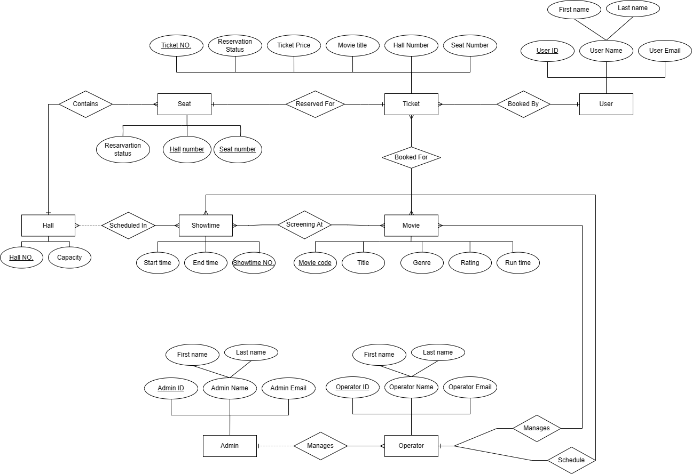

# Booking System for Palestine Tower Cinemas
The system allows customers to easily book tickets online, improving their experience and providing valuable insights for the cinema's management.

## ER Model (Chen notation)

## Team Members
* Lama Abdel Muhsen-1201138
* Hala Gholeh-1201418
* Alaa Saleem-1200001

## Features

* User-friendly interface for easy ticket booking
* Multiple programming languages used for development:
  * Backend: Python (Flask)
  * Frontend: JavaScript, CSS, HTML
* Integration with a MySQL database management system for data storage
* Seamless user experience for browsing movies, selecting showtimes, and choosing seats
* Real-time seat availability updates to avoid double bookings
* Admin functionality to manage movies, showtimes, and user bookings
* Scalable and responsive design for access from any device with an internet connection

